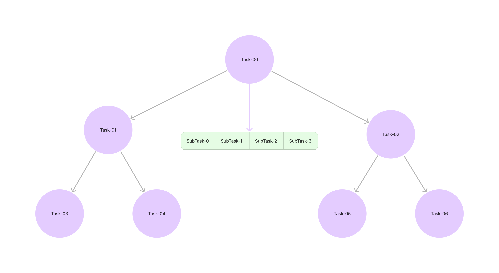
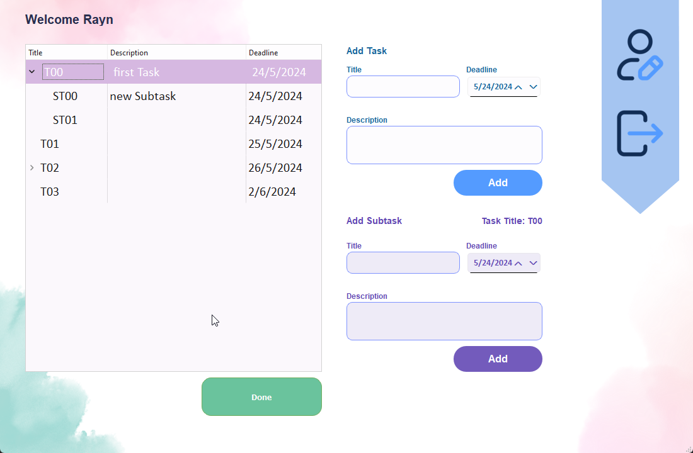
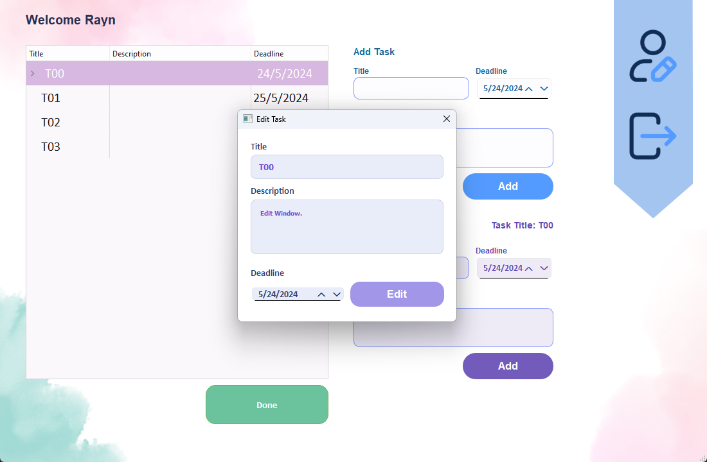

# Task Management 

This is my **Data Structure Course** Mini Project 

 The project is a simple Task Manager Windows application that uses a **Binary Search Tree (BST)** to store tasks.
Each task can have multiple subtasks, which are stored in a vector. If all subtasks of a task are completed, the task is automatically marked as done and deleted from the BST.

## Inside the app pictures

* Login Window

* In the main window, a list of all tasks is displayed using an **in-order traversal** of the tasks tree.

